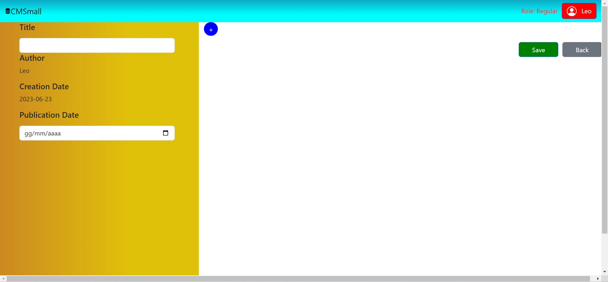
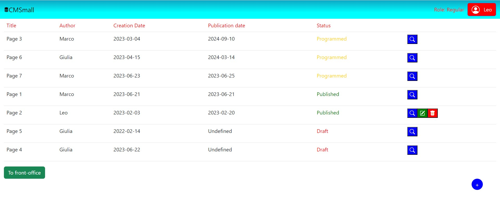

# Exam #1: "CMSmall"

## Student: s314878 CIRONE MARCO 

# Server side

## API Server

- POST `/api/sessions`
  - Used to perform the login
  - Request Body Content: 
    
    { 
        
        "username": "marco@email.it", "password": "password"
    } 
  - Response Body Content:

    { 
      
        "id":1, 
        "username": "marco@email.it",
        "name": "Marco",
        "role": "Admin"
    }
- DELETE `/api/sessions/current`
  - Used to perform logout
  - Request Body Content: none
  - Response Body Content: {}
- GET `api/pubpages`
  - Used to get the list of the published pages. If user is not authenticated, returns a 401 error
  - Response Body Content: 
    [
      
      {
      
        "id": 2,
        "title": "Page 2",
        "author": "Leo",
        "creation_date": "2023-02-03",
        "publication_date": "2023-02-20",
        "userid": 2
      },
      
      {
      
        "id": 7,
        "title": "Page 1",
        "author": "Marco",
        "creation_date": "2023-06-21",
        "publication_date": "2023-06-21",
        "userid": 1
      } ]
- GET `api/pages`
  - Used to get the list of all the pages
  - Response Body Content: 
    
    [ {

        "id": 2,
        "title": "Page 2",
        "author": "Leo",    
        "creation_date": "2023-02-03",
        "publication_date": "2023-02-20",          
        "userid": 2
      },

      {
            
        "id": 3,
        "title": "Page 3",
        "author": "Marco",
        "creation_date": "2023-03-04",
        "publication_date": "2024-09-10",      
        "userid": 1
      },     
        
      {
            
        "id": 5,
        "title": "Page 5",
        "author": "Leo",
        "creation_date": "2022-02-14",     
        "publication_date": null,
        "userid": 2
      },      
        
      {

        "id": 6,
        "title": "Page 6",
        "author": "Giulia",
        "creation_date: "2023-04-15",      
        "publication_date": "2024-03-14",
        "userid": 4
      },
        
      {

        "id": 7,      
        "title": "Page 1",      
        "author": "Marco",      
        "creation_date": "2023-06-21",      
        "publication_date": "2023-06-21",      
        "userid": 1
      } ]
- GET `/api/pages/:id`
  - User to retrieve the blocks of a specific page.
  - Request Parameter: id of the page
  - Response Body Content:
  
    [ {
          
        "id": 2,
        "type": "image",
        "internal": "cat.jpg",
        "pageID": 2,
        "position": 2
      },
      
      {
          
        "id": 3,
        "type": "header",
        "internal": "Cat image",
        "pageID": 2,
        "position": 1
      },
      
      {
          
        "id": 38,
        "type": "image",
        "internal": "house.jpg",
        "pageID": 2,
        "position": 3
    } ]
- GET `/api/settings`
  - Used to retrieve the initial title, images and users
  - Response Body Content: 

    {

      "users": [

      {

        "id": 1,
        "name": "Marco"
      },
          
      {
            
        "id": 2,
        "name": "Leo"
      },
        
      {
      
        "id": 3,
        "name": "Paola"
      },
        
      {
      
        "id": 4,
        "name": "Giulia"
      }],

      "images": [

      {
            
        "id": 1,
        "name": "cat.jpg"
      },
      
      {
              
        "id": 2,
        "name": "dog.jpg"
      },
          
      {
            
        "id": 3,
        "name": "mouse.jpg"
      },
          
      {
          
        "id": 4,
        "name": "house.jpg"
      } ],

        "title": "CMSmall"
    }
- PUT `/api/page`
  - Used to update the content of an existing page. If user is not authorized, returns a 403 error.
  - Request Body Content: 
     
     {
      
      "added": [{
            
        "id": null,
        "type": "image", 
        "internal": "cat.jpg", 
        "pageID": 7, 
        "position": 3
      }],

      "deleted": [{
          
        "id": 63, 
        "type": 'image', 
        "internal": 'house.jpg', 
        "pageID": 7, 
        "position": 3
      }],

      "updated": [{          
      
        "id": 62, 
        "type": "paragraph", 
        "internal": "My new page.", 
        "pageID": 7, 
        "position": 2
      }],

      "page": {
            
        "author": "Marco",
        "creation_date":"2023-06-21", 
        "id": 7,
        "publication_date": "2023-06-21",
        "title": "Page 1",
        "userid": 1
      } }
  - Response Body Content: none
- POST `/api/page` 
  - Used to create a new page. If user is not authorized, returns a 403 error. If there isn't  at least a header and a paragraph/image returns a 422 error. 
  - Request Body Content: 
    
    {
      
      "added": [
       
      {
          
        "id": null, 
        "type": "header", 
        "internal": "My beautiful header", "pageID": 8, 
        "position": 1
      },
        
      {
          
        "id": null, 
        "type": "paragraph", 
        "internal": "My beautiful paragraph", "pageID": 8, 
        "position": 2
      }]

      "page": 
      
      {
        
        "author": "Giulia", 
        "creation_date": "2023-06-22", 
        "id": 8, 
        "publication_date": "", 
        "title": "Page 2", 
        "userid": 4
      } }
  - Response Body Content: none
- DELETE `/api/page/:id`
  - Used to delete a single page. If user is not authorized, returns a 401 error.
  - Request Parameter: id of the page
  - Request Body Content: none,
  - Response Body Content: none
- PUT `/api/title`
  - Used to change the title of the website
  - Request Body Content: {
    
        "title": "newTitle"
    }
  - Response Body Content: none 

## Database Tables

- Table `users` - contains id, email, name, salt, password, role
- Table `pages` - contains id, title, author, creation_date, publication_date
- Table `blocks` - contains id, type, internal, pageID, position
- Table `Images` - contains id, name
- Table `settings` - contains id, setting, value 

# Client side

## React Client Application Routes

- Route `/`: front-office, contains the list of the published pages grouped in a table
- Route `/back_office`: back-office, contains the list of all the pages and allows authorized users to perform operations on them
- Route `/page/:id`: allows the user to visualize the blocks that compose the page, the parameter represents the id of the page in the database
- Route `/edit_page/:id`: allows authorized users to modify the content of a page, the parameter represents the id of the page in the database
- Route `/add_page/:id`: allows authorized users to create a new page, the parameter represents the id the page will have in the database if creation is successfull
- Route `/login`: contains the form to perform the login operation

## Main React Components
- `MakeNavbar` (in `navbar.jsx`): creates the navbar containing the title of the website, which the admin can change, and the button to login or logout.
- `MakeTable` (in `table.jsx`): creates the table used to store the list of the pages (just the published ones or all of them) and creates the buttons to perform the operations on a specific page (create, modify, delete)
- `PageReader` (in `reader.jsx`): allows the user to see all the details of a specific page (author, creation and publication date, blocks)
- `EditPage` (in `editor.jsx`): allows the user to modify the blocks and the details of a specific page or to create a new page from scratch (if authorized)
- `Login` (in `login.jsx`): contains the form used insert the credentials required to perform the login operation

# Usage info

## Example Screenshot

## Users Credentials

- username: marco@email.it, password: password, role: Admin
- username: leo@emailt.it, password: password, role: Regular
- username: giulia@emailt.it, password: password, role: Regular
- username: paola@emailt.it, password: password, role: Regular
